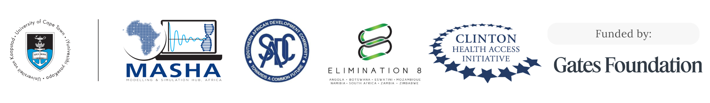
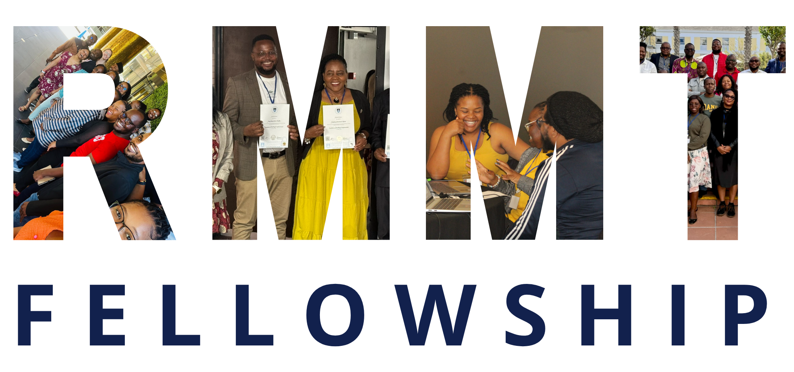

**Welcome to the Quarto version of the RMMT Fellowship Curriculum Pack.**

Use the sidebar to move through the RMMT Fellowship information, curriculum overview, module guides, supporting tools, MEL, scale-up, and facilitator guidance.

Teaching materials and exercise templates are available in the accompanying RMMT Fellowship GitHub repository: \<insert link when ready\>.

{fig-align="center"}

## About the RMMT Fellowship

The Regional Malaria Modelling Translational (RMMT) Fellowship is a six-month executive programme designed to strengthen the use of modelling in malaria decision-making. Delivered from May to October 2025, the inaugural Fellowship brought together 21 fellows from seven countries—Angola, Eswatini, Ghana, Mozambique, Namibia, South Africa, and Zambia—nominated by their National Malaria Programmes (NMPs). The programme was implemented by the Modelling and Simulation Hub, Africa (MASHA) at the University of Cape Town, in partnership with the Southern African Development Community (SADC) Malaria Elimination 8 Initiative (E8) and the Clinton Health Access Initiative (CHAI) South Africa Office, and funded by the Gates Foundation (GF). The Fellowship addresses a critical gap between modelling evidence and its use in policy and programme decision-making. It builds the capacity of policymakers, programme leaders, and technical staff to interpret model-based insights as a practical decision-support tool in resource-constrained settings.

The Fellowship combined in-person and virtual learning across key areas, with three immersive, full-time in-person blocks held in May, August, and October 2025. The curriculum topics spanned the full modelling process—from framing policy-relevant questions and understanding systems, through model design, development, and critique, to interpreting outputs and communicating findings—while also addressing cross-cutting themes such as uncertainty, health economics, and stakeholder engagement. A central component was the Capstone Project, where fellows worked in country teams to develop proposals for modelling analyses to address priority policy questions.

The RMMT Fellowship demonstrated strong early impact, including increased confidence in interpreting modelling outputs, strengthened collaboration between technical and policy stakeholders, and a pipeline of country-led modelling projects aligned with programme priorities. Fellows also reported substantial gains in their ability to apply model-based insights in decision-making processes, define policy-relevant questions, and translate findings into actionable recommendations. The inaugural implementation of the RMMT Fellowship has demonstrated its ability to strengthen capacity to bridge the gap between modelling and policy, supporting more informed, data-driven decision-making in malaria programmes. It also provides a framework that can be readily transferred to other areas of disease modelling for public health.

## Purpose of the Curriculum Pack

This curriculum pack has been developed to document and consolidate the content, structure, and learning approach of the RMMT Fellowship, providing a practical resource for future delivery, adaptation, and scale-up. It is intended to support facilitators, partners, and institutions in implementing similar programmes, as well as to enable broader access to the Fellowship’s materials and methodologies.

The pack is organised to provide both a high-level overview of the curriculum framework and detailed guidance for delivery at the module level. It includes descriptions of core themes, session structures, learning objectives, and practical exercises, alongside tools, templates, and resources to support application in real-world contexts. In doing so, it aims to ensure that the curriculum is not only informative but also actionable, enabling users to replicate and adapt the Fellowship to different settings and priority areas.

{fig-align="center"}
